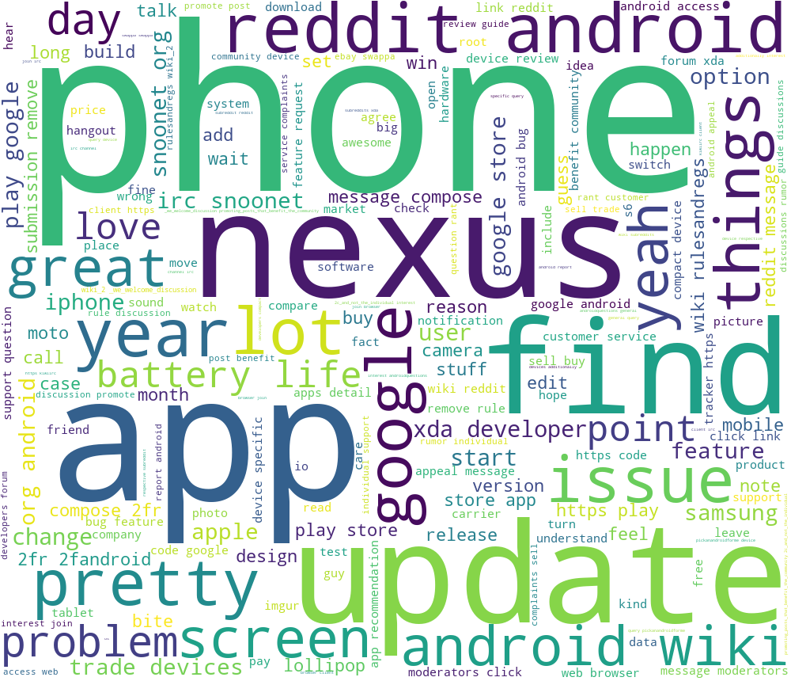
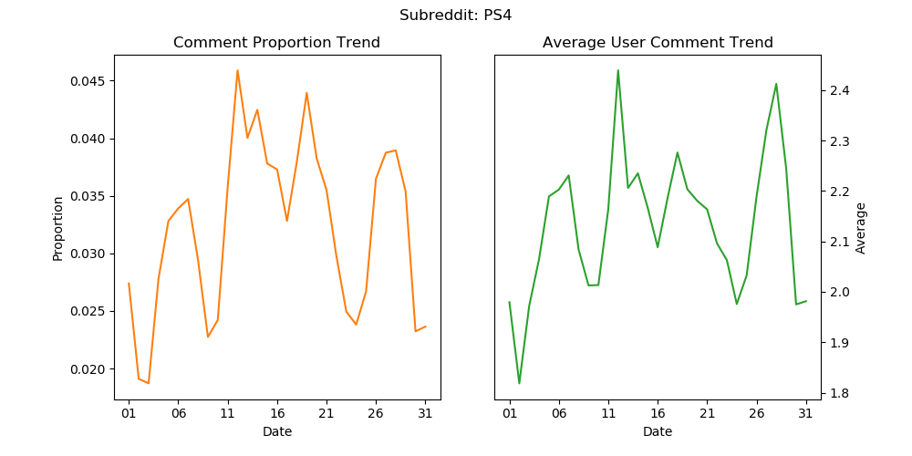
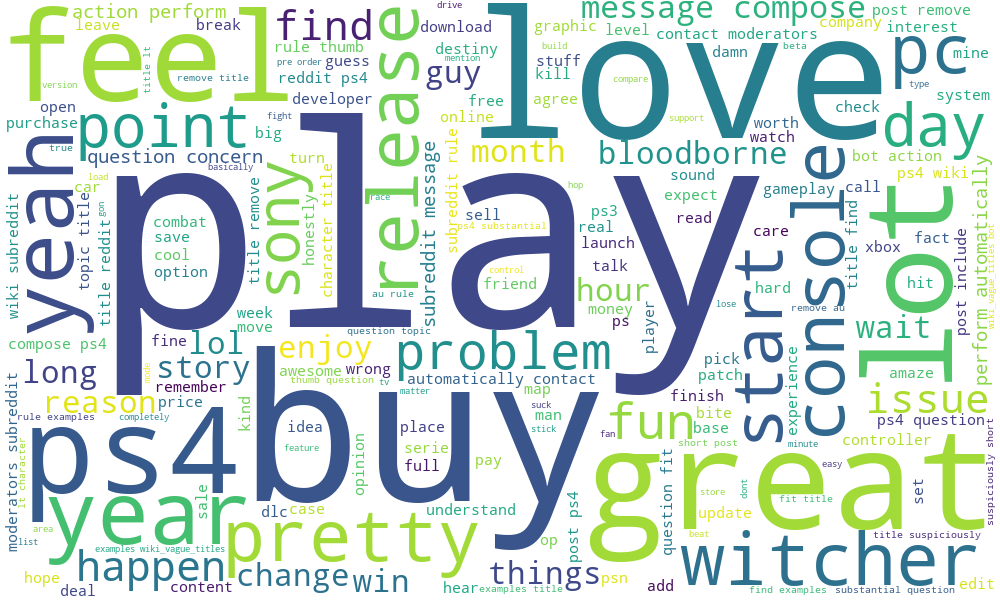

```{r setup, include=FALSE}
knitr::opts_chunk$set(echo = TRUE)
```

## Introduction

The main purpose of this project is to analyze the popularity and user actvations of subreddits based on the May 2015 Reddit Comments dataset. We first filtered out 100 subreddits with the most amount of comments during May 2015 and analyzed the word cloud plots of these subreddits. Then we found out some most active subreddits by sorting them by the average amount of comments per user. Finally, we analyzed some plots to analyze the tendency of popularity over time of popular subreddits.

## Dataset
Our dataset is May 2015 Reddit Comments from Kaggle. The dataset's size is 30GB. It contains 1.7 billion comments from Reddit in May 2015 and related information such as auther, subreddit, etc.
We used following variables:

* ```subreddit```: The subreddit in which the comment appears
* ```author```: The author of the comment
* ```body```: The body text of the comment
* ```id```: ID of the comment


## Word Clouds with python in CHTC

We ran 100 parallel jobs for each subreddits. And in each job we:

* combine the comments into a single text
* transfer all the letters into lower case
* transfer all the words into prototype
* set stopwords to delete meaningless words
* plot wordcloud

Exaple of Androit wordcloud:

{width=60%}

## Most active subreddits with python in CHTC

We used the average amount of comments per user to evaluate the active level of each subreddit in May 2015. For a subreddit, its active level is given by:

$$
activeLevel(subreddit)=\frac{\# \space of \space comments \space in \space subreddit}{\# \space of \space related \space users}
$$

It was reasonable to use this metrics to measure the active level because the subreddit with a higher average user active level could be considered to be more active.

We can compute the value of this metrics for every subreddit in parallel using CHTC. Then, we can sort the subreddits by the active level, and the top 5 most active subreddits are as following:

| Top | subreddit | Active Level |
|-----|-----------|-------------|
| 1 | Random Acts Of Amazon | 54.53407683 |
| 2 | newsokur | 52.71981321 |
| 3 | Pokemon Trades | 43.17164179 |
| 4 | Global Offensive Trade | 29.00911372 |
| 5 | India |	20.83660602 |


## Trend analysis with python

With data from every day in May, we can also make some plots to roughly analysis daily heat of subreddit and users in different subreddit. We can do parallel jobs on every subreddit to make plots. Here we analysis the trend of daily comment amount and daily average user comments in each subreddit with plots as below:

{width=90%}

The left plot shows how many comments are made in one day and how it changes through the month. The right plot shows the change of average user comments through the month. 

We can dig further with these plots. Take the subreddit r/PS4 as example. Actually 4 famous games launched in May 2015, which are

| Game | Launch Date |
|:----:|:-----------:|
| Final Fantasy IV | May 12 |
| Project CARS | May 12 |
| The Witcher 3: Wild Hunt | May 19 |
| Splatoon | May 29 |

The launch date of these popular games all correspond to the peaks of both plots of Subreddit Trend, which means users are more activate when new game launched in r/PS4. From above we can also obtain the word cloud of this subreddit.


{width=70%}


From the word cloud, we can see that people mentions a lot about 'Witcher' and like to share their feeling about this game and other games. This month players mostly have a positive attitude towards new games this month.  

**The weakness of our project: we did not analyse all words and all subreddits. If someone is interested in a particular subreddit or word, he/she needs to analyse him/herself with our method.**


## Conclusion
We found out active communities such as Random Acts Of Amazon, Pokemon Trades. We also plotted user activity trend and word activity trend. Based on our work, Reddit can:


* Monitor active communities and users.

* Relate comment-activity trend with big events such as game lunch and Black Friday together, then allocate sources more efficiently.

* Monitor the daily trend of a word appearance such as "witcher" to see what topics are popular.

